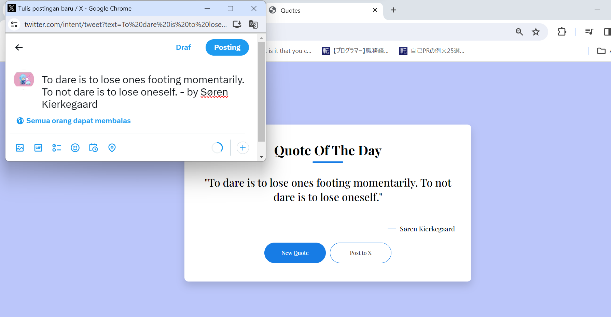

# Quotes App Readme
This repository contains a simple web application that fetches and displays a random quote from the Quotable API. Users can click a button to load a new quote and have the option to post the current quote to a social media platform.

## Features
1. Displaying a Random Quote
Upon loading the page or clicking the "New Quote" button, the application fetches a random quote from the Quotable API and displays it on the page.

2. Posting to Social Media
Users can click the "Post to X" button to share the current quote on a social media platform. In the provided code, the button is labeled "Post to X," and it opens a X/Twitter intent window with the current quote and author.

## Usage
- Open the index.html file in a web browser.
- Click the "New Quote" button to fetch and display a new random quote.
- Optionally, click the "Post to X" button to share the current quote on a social media platform (X/Twitter in this case).

## Dependencies
This Quotes application relies on the Quotable API to fetch random quotes. No additional dependencies or libraries are used.

## Acknowledgments
The Quotable API for providing a free and accessible source of quotes.
Inspired by projects that aim to spread positivity and inspiration.

## image
